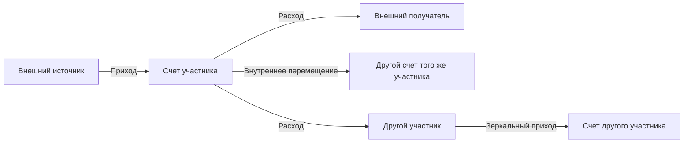

# Методика разработки систем на Google Sheets и Apps Script

**Статус:** Candidate  
**Назначение:** единый порядок проектирования, создания, запуска и проверки систем на базе Google Sheets, Google Apps Script и мобильных веб-интерфейсов.  
**Ответственная функция:** разработчик системы совместно с владельцем процесса.

## 1. Основной принцип

Сначала проектируется процесс и движение данных, затем интерфейс и код. Система считается готовой только тогда, когда определены и проверены ее начальное состояние, входы, обработка, исправления и выходы.

Облачная таблица является единым источником данных. Пользовательские листы, веб-формы и отчеты являются управляемыми представлениями и каналами ввода, а не независимыми базами.

## 2. Обязательные вопросы до разработки

До создания таблиц и скриптов зафиксировать:

1. Цель системы и решения, которые она должна поддерживать.
2. Пользователей, роли, права просмотра, ввода, исправления и администрирования.
3. Сущности и справочники: участники, объекты, счета, статьи, статусы и другие значения.
4. Виды операций и строгие правила для каждой операции.
5. Какие операции создают одну запись, а какие требуют согласованных зеркальных записей.
6. Допустимые маршруты движения данных и запрещенные маршруты.
7. Минимальный набор полей, обязательность и проверки каждого поля.
8. Каналы ввода: таблица, веб-форма, импорт или интеграция.
9. Механизм исправления уже проведенной операции и журнал изменений.
10. Защиту от повторной отправки и дублей.
11. Начальное состояние системы: дата начала, начальные остатки, исторические данные, ответственный за ввод и правило блокировки после проверки.
12. Выходы системы: журнал, остатки, пользовательские представления, выгрузки и уведомления.
13. Закрытие периода, архивирование, восстановление и резервирование.
14. Ограничения безопасности: конфиденциальные данные, ссылки, токены и права доступа.

Пропуск начальных данных является дефектом ТЗ. Нельзя принимать систему учета, не проверив, как она начинает считать с первого дня.

## 3. Обязательные материалы ТЗ

До реализации владелец процесса утверждает следующие материалы.

### 3.1. Краткое ТЗ

ТЗ содержит цель, границы системы, роли, операции, справочники, правила расчета, права, исправления, запуск и критерии приемки. Термины должны использоваться последовательно. Если система применяет кодированные обозначения, интерфейс и документация используют именно их без лишней расшифровки.

### 3.2. Блок-схема процесса

Схема показывает допустимые входы, операции, преобразования, участников и выходы. Запрещенные переходы отмечаются явно.



### 3.3. Логика пользователя

Для каждой роли описывается последовательность действий: что пользователь видит, что вводит, какую кнопку нажимает, какой результат получает и как исправляет ошибку.

### 3.4. Движение данных

Для каждого действия указывается источник, проверка, запись в единый журнал, производные записи, пересчет итогов, аудит и отображение результата.

### 3.5. Карта листов и интерфейсов

Для каждого листа или экрана указать назначение, владельца, источник данных, разрешенные изменения и связи с другими компонентами. Лишние листы и поля не создавать.

### 3.6. Визуальный прототип

До кодирования показать компактный макет таблицы и мобильного интерфейса с реальными названиями полей и кнопок. Пользователь утверждает порядок колонок, действия и читаемость.

### 3.7. План запуска

План запуска обязательно включает дату начала учета, начальные остатки или стартовые записи, проверку их полноты, блокировку или контроль последующего изменения, обучение пользователей и порядок возврата к предыдущей версии.

## 4. Архитектура Google Sheets

Рекомендуемая минимальная структура:

- единый журнал операций как источник фактов;
- справочники для контролируемых значений;
- отдельный лист начальных данных, если система начинает работу не с нуля;
- сводные листы и пользовательские листы как вычисляемые представления;
- журнал изменений и технический лист доступа, скрытые или защищенные от обычных пользователей.

Производные остатки и отчеты не должны редактироваться вручную. Их результат складывается из начального состояния и проведенных операций.

Последние операции показываются сверху, если это соответствует рабочему сценарию. Даты присутствуют в журнале и в сводных состояниях.

## 5. Операции, двойная запись и исправления

Операции между независимыми участниками оформляются как согласованная пара: расход одной стороны и приход другой стороны с единым идентификатором операции. Внутреннее перемещение между собственными счетами является отдельным типом операции.

Пользователь не исправляет зеркальные строки вручную. Исправление выполняется через управляемую команду:

1. выбрать исходную операцию;
2. загрузить ее в форму исправления;
3. изменить разрешенные поля;
4. проверить новые данные;
5. атомарно обновить исходную и зеркальную записи;
6. записать старые и новые значения в аудит;
7. пересчитать представления и остатки.

Отмена нужна только если бизнес-процесс допускает признание операции несуществующей. Если типичные ошибки относятся только к сумме или реквизитам, достаточно исправления без отдельной функции отмены.

Защита от дублей использует устойчивый идентификатор операции и идемпотентную обработку повторного нажатия или повторной отправки формы.

## 6. Apps Script и веб-интерфейс

Apps Script отвечает за проверки, проведение операций, согласованные записи, исправления, аудит, обновление представлений и веб-интерфейс.

Правила:

- действующим кодом считается код в связанном облачном проекте Apps Script;
- локальная копия `.gs` является резервной или рабочей копией только после сверки с облачным проектом;
- рабочая ссылка веб-приложения заканчивается на `/exec`; ссылка `/dev` предназначена для разработки;
- после изменения кода проверить, требуется ли новая версия развертывания;
- персональные ссылки и токены не публиковать в GitHub;
- независимые системы должны иметь независимые таблицы, проекты, развертывания и токены;
- веб-форма должна работать на телефоне в портретной ориентации без горизонтальной прокрутки страницы.

## 7. Стиль таблиц и форм

Использовать спокойный минималистичный дизайн:

- белый основной фон;
- темный текст;
- светло-серые служебные блоки;
- один сдержанный акцентный цвет;
- предупреждения только спокойным красным или янтарным цветом;
- четкие границы таблиц, одинаковые отступы и читаемые заголовки;
- даты, статусы, номера и табличные данные выравнивать последовательно;
- не применять яркие заливки, декоративные градиенты и лишние панели.

Форма показывает только необходимые поля и действия. На мобильном экране элементы располагаются в одну колонку, кнопки имеют достаточный размер, длинные значения переносятся.

## 8. Этапы работы

1. **Обследование:** собрать правила, примеры, старые формы и ограничения.
2. **ТЗ:** оформить вопросы, решения, термины, начальные данные и критерии приемки.
3. **Схемы:** утвердить блок-схему процесса, пользовательскую логику и движение данных.
4. **Прототип:** показать листы и интерфейсы без полной автоматизации.
5. **Ядро:** реализовать единый журнал, проверки, расчеты и аудит.
6. **Табличный ввод:** проверить проведение и исправление из Google Sheets.
7. **Веб-форма:** добавить мобильный интерфейс поверх проверенного ядра.
8. **Миграция и запуск:** ввести начальные данные, сверить результаты, ограничить изменения.
9. **Приемка:** выполнить тестовую матрицу и зафиксировать результат.
10. **Эксплуатация:** вести изменения через отдельные версии, журнал решений и архив.

## 9. Обязательная тестовая матрица

Проверить минимум:

- пустую систему и запуск с начальными данными;
- начальные остатки каждого пользователя и каждого счета;
- каждую допустимую операцию и каждый допустимый маршрут;
- запрещенные маршруты и незаполненные обязательные поля;
- зеркальную операцию и единый идентификатор;
- исправление суммы, реквизитов и стороны операции;
- повторное нажатие и повторную отправку формы;
- корректность журнала, пользовательских листов и сводных остатков;
- разные даты операций и дату состояния остатков;
- права обычного пользователя и администратора;
- работу на телефоне шириной 390 px;
- действующие ссылки таблицы, редактора и `/exec` веб-приложения;
- независимость копий системы и отсутствие ссылок на старое развертывание;
- восстановление после ошибки или неудачного обновления.

Критический инвариант учета: итоговый остаток равен начальному остатку плюс приходы минус расходы с учетом допустимых внутренних перемещений.

## 10. Типичные ошибки, которые нужно предотвращать

- Разработка начинается до утверждения терминов и операций.
- В ТЗ отсутствуют начальные остатки и сценарий запуска.
- Структура усложняется лишними листами и полями.
- Одинаковые по смыслу сущности разделяются на разные справочники без необходимости.
- Пользователю разрешается вручную менять системные и зеркальные записи.
- Исправление обновляет только одну сторону операции.
- Остатки проверяются только для одного типа счета.
- Локальная копия скрипта ошибочно считается действующей.
- Ярлык `.url` принимается за исходный код приложения.
- После копирования системы остаются ссылки на старую таблицу, проект или развертывание.
- Проверяется интерфейс на компьютере, но не на телефоне.

## 11. Организация проектной папки

Проектные данные не размещаются в базе знаний. Рабочая папка строится по схеме:

```text
<Project_Workspace>/
  README.md
  START_HERE.md
  AGENTS.md
  01_Input/<Project>/00_Inbox/
  02_Drafts/<Project>/
  03_Final/<Project>/
  04_Templates/<Project>/
  05_Archive/<Project>/
  06_Reference/<Project>/
  07_Exports/<Project>/
```

- `01_Input` содержит неизменяемые исходники.
- `02_Drafts` содержит разработку, схемы и тестовые версии.
- `03_Final` содержит действующие утвержденные ресурсы и пользовательские ссылки.
- `05_Archive` содержит замененные версии, явно не являющиеся действующими.
- `06_Reference` содержит решения, индекс проекта и проектные инструкции.

## 12. Условие готовности

Система готова, когда владелец процесса может ответить на четыре вопроса и подтвердить ответы тестами:

1. С какого состояния система начинает работу?
2. Какими способами данные входят и как проверяются?
3. Как данные изменяются, исправляются и защищаются от дублей?
4. Какие результаты получают пользователи и как подтверждается их правильность?
